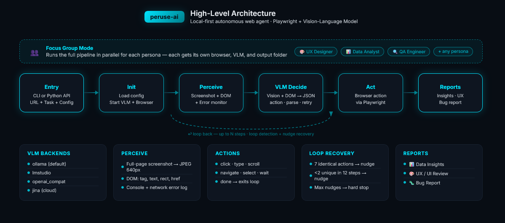

# Peruse-AI

[](https://pypi.org/project/peruse-ai/)
[](https://pypi.org/project/peruse-ai/)
[](https://github.com/Prodoorknob/peruse-ai/blob/master/LICENSE)
[](https://github.com/Prodoorknob/peruse-ai)

**A local-first universal web agent** that autonomously explores web applications and produces structured reports, powered by [Playwright](https://playwright.dev/python/) and a local Vision-Language Model (e.g. Qwen, Gemma via Ollama, LM Studio, or Jina VLM).

---

## Features

- **Autonomous Web Exploration** — Give it a URL and a goal; it figures out the rest.
- **Dual-Channel Perception** — Combines DOM extraction *and* visual screenshots for robust element detection.
- **100% Local** — Your data never leaves your machine. Runs on Ollama, LM Studio, or any OpenAI-compatible local endpoint.
- **Custom Personas** — Assign the agent a specific role or perspective (e.g. "a senior UX designer", "a QA engineer") to shape how it evaluates pages.
- **Focus Groups** — Run multiple personas concurrently against the same URL to gather diverse feedback in a single session.
- **Smart Loop Recovery** — Instead of hard-stopping when stuck, the agent receives nudge messages suggesting alternative actions before eventually giving up.
- **Multi-Output Pipeline** — Generates three report types from a single session:
  - **Data Insights** — Summaries of charts, tables, and visible data.
  - **UX/UI Review** — Contrast, layout, accessibility, and usability critique.
  - **Bug Report** — Console errors, failed requests, and reproduction steps.

---

## Demo


The demo above shows a full `peruse run` session against the [USDA QuickStats Analytics](https://stats-usda.vercel.app/) dashboard using a local Gemma 3 model:

```bash
peruse run --url "https://stats-usda.vercel.app/" \
           --task "Explore the main Dashboard and do a UI critique" \
           --model "gemma3:12b" \
           --reports "ux" \
           --persona "A seasoned UX designer with 10+ year expertise in modern website design and UI" \
           --extra-instructions "stick to the year 2021 and 2022"
```

The agent autonomously navigates the dashboard, captures screenshots at each step, and produces a structured [UX review report](assets/ux_review_ChatOllama_20260303_165425.md) covering visual hierarchy, WCAG accessibility, touch target sizes, information density, and design consistency.

---

## Architecture

<p align="center">
  
</p>

The pipeline follows six stages: **Entry** (CLI / Python API) &rarr; **Init** (load config, start VLM + browser) &rarr; **Perceive** (screenshot + DOM + error monitor) &rarr; **VLM Decide** (vision + DOM &rarr; JSON action) &rarr; **Act** (Playwright browser action) &rarr; **Reports** (Data Insights, UX Review, Bug Report). The Perceive&ndash;Act loop runs up to *N* steps with built-in loop detection and nudge recovery.

> The interactive version of this diagram is available at [`assets/peruse_ai_flowchart_compact_mono.html`](assets/peruse_ai_flowchart_compact_mono.html) — open it locally in a browser.

---

## Quickstart

### Prerequisites

1. **Python 3.10+**
2. **Ollama** installed and running ([install guide](https://ollama.com/download))
3. Pull the VLM model:
   ```bash
   ollama pull qwen2.5-vl:7b
   ```

### Install

```bash
pip install peruse-ai
playwright install chromium
```

### Run

```bash
# Full exploration
peruse run --url "https://example.com/dashboard" \
           --task "Explore the dashboard and summarize all visible data"

# With a persona
peruse run --url "https://example.com/dashboard" \
           --task "Evaluate the dashboard" \
           --persona "a senior UX designer with 15 years of experience"

# With extra instructions
peruse run --url "https://example.com/dashboard" \
           --task "Review the dashboard" \
           --extra-instructions "Pay special attention to color contrast and WCAG compliance"

# Bug scan only
peruse scan --url "https://example.com" \
            --task "Click every link and report errors"

# Focus group — multiple personas in parallel
peruse focus-group --url "https://example.com/dashboard" \
                   --task "Evaluate the dashboard and identify issues" \
                   --personas "a senior UX designer,a data analyst,a QA engineer"

# Check VLM connectivity
peruse check-vlm
```

### Python API

```python
import asyncio
from peruse_ai import PeruseAgent, PeruseConfig

config = PeruseConfig(
    vlm_model="qwen2.5-vl:7b",
    persona="an experienced data analyst",
    extra_instructions="Focus on data accuracy and chart readability",
)
agent = PeruseAgent(
    config=config,
    url="https://example.com/dashboard",
    task="Summarize the visible data and flag any UI issues",
)
result = asyncio.run(agent.run())
print(result.final_summary)
```

#### Focus Group API

```python
import asyncio
from peruse_ai import FocusGroup, PeruseConfig

config = PeruseConfig(vlm_model="qwen2.5-vl:7b")
fg = FocusGroup(
    personas=[
        "a senior UX designer",
        "a data analyst",
        "a QA engineer",
    ],
    url="https://example.com/dashboard",
    task="Evaluate the dashboard and identify issues",
    config=config,
)
result = asyncio.run(fg.run())

for persona, agent_result in result.persona_map.items():
    print(f"{persona}: {agent_result.final_summary}")
```

Each persona runs concurrently with its own browser and VLM instance. Reports are saved to separate sub-directories under the output path (e.g. `./peruse_output/a-senior-ux-designer/`).

---

## CLI Reference

### `peruse run`

Full exploration session with all reports.

```
peruse run [OPTIONS]
```

| Option | Short | Default | Description |
|---|---|---|---|
| `--url` | | *(required)* | Starting URL to explore |
| `--task` | | *(required)* | High-level goal for the agent |
| `--model` | | `qwen3-vl:6b` | VLM model name |
| `--backend` | | `ollama` | VLM backend: `ollama`, `lmstudio`, `openai_compat`, `jina` |
| `--base-url` | | *(auto-detected)* | VLM API base URL |
| `--output` | `-o` | `./peruse_output` | Output directory for reports and screenshots |
| `--max-steps` | | `50` | Maximum agent loop iterations |
| `--headless/--no-headless` | | `--headless` | Run browser in headless mode |
| `--reports` | | `all` | Reports to generate: `insights`, `ux`, `bugs`, `all` (comma-separated) |
| `--persona` | | *(none)* | Agent persona prepended to the system prompt |
| `--extra-instructions` | | *(none)* | Additional instructions appended to the agent prompt |
| `--max-report-screenshots` | | `10` | Max unique screenshots for VLM reports (0 = use all) |
| `--verbose` | `-v` | off | Enable debug logging |

### `peruse scan`

Lightweight bug scan (bug report only, no VLM-powered analysis).

```
peruse scan [OPTIONS]
```

| Option | Short | Default | Description |
|---|---|---|---|
| `--url` | | *(required)* | Starting URL to scan |
| `--task` | | `"Navigate all links and report any errors encountered."` | Scan goal |
| `--model` | | `qwen3-vl:6b` | VLM model name |
| `--backend` | | `ollama` | VLM backend |
| `--base-url` | | *(auto-detected)* | VLM API base URL |
| `--output` | `-o` | `./peruse_output` | Output directory |
| `--max-steps` | | `30` | Maximum steps for scan |
| `--persona` | | *(none)* | Agent persona |
| `--extra-instructions` | | *(none)* | Additional instructions |
| `--verbose` | `-v` | off | Enable debug logging |

### `peruse focus-group`

Run multiple personas concurrently against the same URL. Each persona gets its own browser, VLM, and output sub-directory.

```
peruse focus-group [OPTIONS]
```

| Option | Short | Default | Description |
|---|---|---|---|
| `--url` | | *(required)* | Starting URL to explore |
| `--task` | | *(required)* | High-level goal for all agents |
| `--personas` | | *(required)* | Comma-separated personas or path to a text file (one per line) |
| `--model` | | `qwen3-vl:6b` | VLM model name |
| `--backend` | | `ollama` | VLM backend |
| `--base-url` | | *(auto-detected)* | VLM API base URL |
| `--output` | `-o` | `./peruse_output` | Base output directory (each persona gets a sub-directory) |
| `--max-steps` | | `50` | Maximum agent iterations per persona |
| `--headless/--no-headless` | | `--headless` | Run browsers in headless mode |
| `--reports` | | `all` | Reports to generate per persona |
| `--extra-instructions` | | *(none)* | Additional instructions for all agents |
| `--max-report-screenshots` | | `10` | Max unique screenshots for VLM reports (0 = use all) |
| `--verbose` | `-v` | off | Enable debug logging |

**Personas from a file:**

```bash
# personas.txt (one per line)
a senior UX designer
a data analyst specializing in dashboards
a QA engineer focused on accessibility

peruse focus-group --url "https://example.com" \
                   --task "Evaluate the application" \
                   --personas personas.txt
```

### `peruse check-vlm`

Verify VLM backend connectivity.

```
peruse check-vlm [OPTIONS]
```

| Option | Short | Default | Description |
|---|---|---|---|
| `--model` | | `qwen3-vl:6b` | VLM model name |
| `--backend` | | `ollama` | VLM backend |
| `--base-url` | | *(auto-detected)* | VLM API base URL |
| `--verbose` | `-v` | off | Enable debug logging |

---

## Configuration

All settings can be passed via constructor, environment variables (`PERUSE_*`), or a `.env` file.

| Setting | Env Var | Default | Description |
|---|---|---|---|
| `vlm_backend` | `PERUSE_VLM_BACKEND` | `"ollama"` | `"ollama"`, `"lmstudio"`, `"openai_compat"`, or `"jina"` |
| `vlm_model` | `PERUSE_VLM_MODEL` | `"qwen3-vl:6b"` | Model identifier |
| `vlm_base_url` | `PERUSE_VLM_BASE_URL` | `"http://localhost:11434"` | API endpoint |
| `vlm_num_ctx` | `PERUSE_VLM_NUM_CTX` | `32768` | Context window size (tokens) for Ollama |
| `vlm_retries` | `PERUSE_VLM_RETRIES` | `2` | Retry attempts on VLM crash |
| `vlm_cooldown` | `PERUSE_VLM_COOLDOWN` | `3.0` | Seconds to wait before retry |
| `headless` | `PERUSE_HEADLESS` | `True` | Run browser headless |
| `max_steps` | `PERUSE_MAX_STEPS` | `50` | Max agent loop iterations |
| `max_dom_elements` | `PERUSE_MAX_DOM_ELEMENTS` | `100` | Max DOM elements per step (0 = unlimited) |
| `output_dir` | `PERUSE_OUTPUT_DIR` | `"./peruse_output"` | Report output directory |
| `persona` | `PERUSE_PERSONA` | `""` | Agent persona prepended to the system prompt |
| `extra_instructions` | `PERUSE_EXTRA_INSTRUCTIONS` | `""` | Additional instructions appended to the agent prompt |
| `max_nudges` | `PERUSE_MAX_NUDGES` | `3` | Max nudge messages before hard-stopping on loops |
| `max_report_screenshots` | `PERUSE_MAX_REPORT_SCREENSHOTS` | `10` | Max unique screenshots for VLM reports (0 = use all) |

### Persona

The `persona` setting prepends an identity to the agent's system prompt. This shapes how the agent interprets and evaluates what it sees, without affecting its core browsing capabilities.

```bash
peruse run --url "https://example.com" \
           --task "Review the application" \
           --persona "an extremely experienced AD for a prestigious american sports focused university"
```

Or via environment variable:

```bash
export PERUSE_PERSONA="a senior accessibility auditor"
peruse run --url "https://example.com" --task "Audit this page"
```

### Extra Instructions

The `extra_instructions` setting appends domain-specific guidance to the agent prompt without replacing the base prompt's JSON format rules and action definitions.

```bash
peruse run --url "https://example.com" \
           --task "Explore the dashboard" \
           --extra-instructions "Focus on data tables. Ignore the navigation sidebar."
```

### Loop Recovery (Nudges)

When the agent gets stuck repeating the same action, it receives a nudge message suggesting alternative approaches instead of immediately stopping. The `max_nudges` setting controls how many recovery attempts are allowed before the agent hard-stops (default: 3).

```bash
# Allow more recovery attempts
peruse run --url "https://example.com" --task "Explore" \
           PERUSE_MAX_NUDGES=5
```

Or in Python:

```python
config = PeruseConfig(max_nudges=5)
```

---

## Intel ARC GPU (Vulkan / IPEX-LLM)

Peruse-AI can run on Intel ARC GPUs via the [IPEX-LLM](https://github.com/intel-analytics/ipex-llm) project, but this backend is **experimental and unstable**. The Ollama model runner frequently crashes with:

```
model runner has unexpectedly stopped, this may be due to resource limitations
or an internal error (status code: 500)
```

**Known issues:**
- The Vulkan backend crashes when receiving rapid back-to-back VLM calls
- Shader compilation on first run can cause startup timeouts
- Large context windows (`vlm_num_ctx` > 8192) may exhaust GPU memory

**Workarounds:**
1. **Warm up the model first** — Run `ollama run gemma3:4b "hello"` in your terminal before using `peruse run`. This pre-compiles shaders and loads the model into VRAM.
2. **Use a smaller context window** — Keep `vlm_num_ctx` at `4096` or `8192`.
3. **Increase retries** — Set `vlm_retries=3` and `vlm_cooldown=5.0` to give the GPU time to recover between crashes.
4. **Prefer NVIDIA/CUDA** — If available, an NVIDIA GPU with the standard Ollama build is significantly more stable.

---

## Development

```bash
git clone https://github.com/rajas/peruse-ai.git
cd peruse-ai
pip install -e ".[dev]"
playwright install chromium
pytest tests/ -v
```

To use the **Jina VLM** cloud backend, set your API key:
```bash
# .env file
PERUSE_VLM_API_KEY=jina_xxxxxxxxxxxx
```
```bash
peruse run --url "https://example.com" --task "Explore" --backend jina
```

---

## License

MIT
